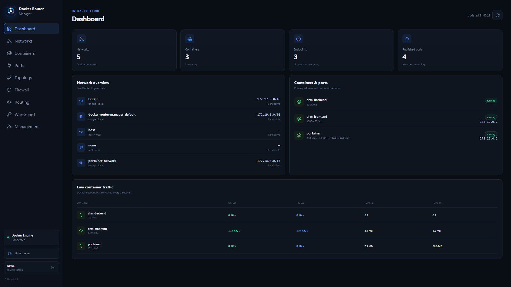
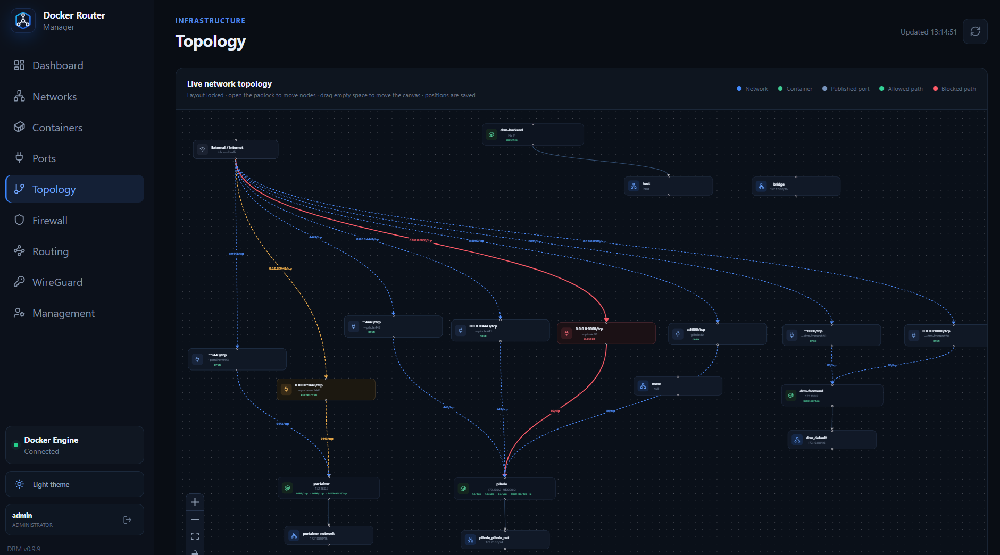
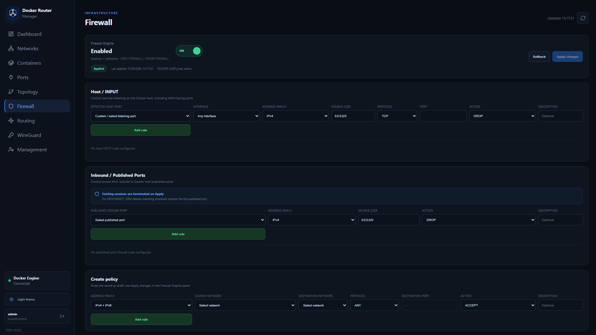
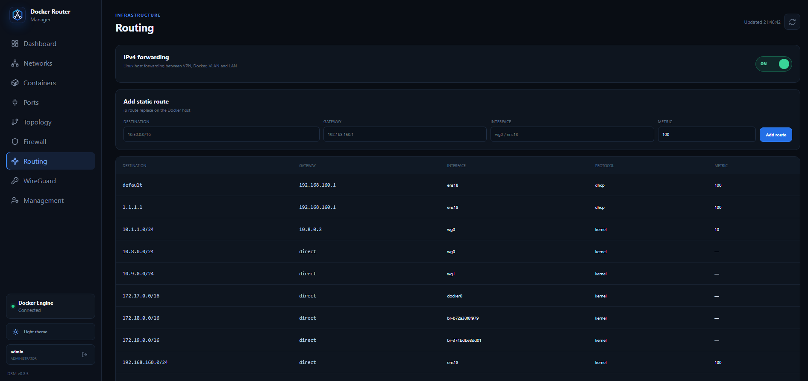
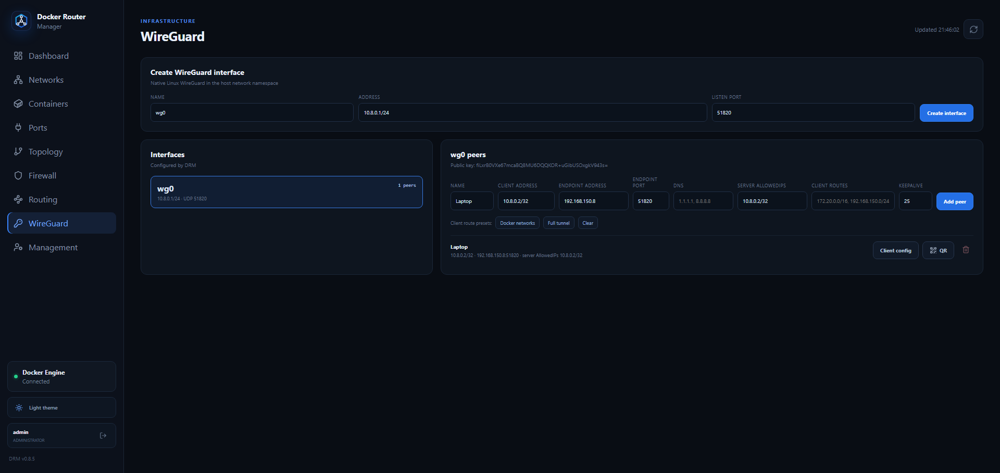

<div align="center">


# Docker Router Manager

### Docker networking, routing, firewall and WireGuard management from one web interface

**Version 0.8.5**


</div>

---

## Overview

**Docker Router Manager (DRM)** is a web-based network management interface for Docker hosts. It combines Docker network visibility with host-level routing, firewall policy management, interactive topology visualization and native WireGuard configuration.

DRM is designed for environments where Docker is more than an application runtime and the Linux host also acts as a network gateway between containers, VPN clients, LANs and other routed networks.



## Highlights

- **Live Docker overview** — networks, containers, endpoints and published ports.
- **Real-time container traffic** — RX/TX rates and cumulative traffic counters.
- **Interactive topology** — Docker networks, containers, published ports and external paths in one diagram.
- **Firewall Engine** — host-level Docker traffic policy using `iptables` and the `DOCKER-USER` path.
- **Published-port filtering** — control access to exposed Docker services by source CIDR.
- **Routing Engine** — view the Linux routing table, manage static routes and IPv4 forwarding.
- **Native WireGuard management** — interfaces, peers, routes, DNS, client configuration and QR codes.
- **Authentication and RBAC** — Administrator, Operator and Viewer roles.
- **Dark and light themes** — dark mode is enabled by default.
- **Docker-native deployment** — frontend and backend run as containers while the backend manages the host network namespace.

---

## Visual Network Topology

DRM builds a live topology from Docker networks, containers, published ports and firewall paths.



The topology can represent the path from **External / Internet → published host port → container** and the relationships between containers and Docker networks. Firewall state can be reflected directly in the visual path, making network policy easier to understand than from rule tables alone.

---

## Firewall Engine

The Firewall module manages traffic at the Docker host level and integrates with Docker's forwarding path.



### Published ports

Create source-based policies for ports published by Docker, for example:

```text
0.0.0.0:9443/tcp → portainer:9443

Source: 192.168.100.0/24
Action: DROP
```

DRM can also terminate matching existing conntrack sessions when a published-port block is applied, so a new policy does not affect only future connections.

### Network policies

Policies can be defined between Docker networks with protocol and destination-port matching.

Firewall changes use an **Apply / Rollback** workflow and the Firewall Engine can be enabled or disabled from the GUI.

> **Important:** Firewall and routing changes affect the Docker host. Always keep an alternative management path available when testing remote firewall rules.

---

## Routing Engine

DRM exposes the Linux host routing table and provides controls for host forwarding and DRM-managed static routes.



Features include:

- IPv4 forwarding ON/OFF
- current Linux routing table
- connected Docker routes
- WireGuard routes
- static destination routes
- gateway selection
- outgoing interface
- route metric
- persistence of DRM-managed routes

Example:

```text
Destination: 10.50.0.0/16
Gateway:     192.168.150.1
Interface:   ens18
Metric:      100
```

This makes it possible to use the Docker host as a router between Docker networks, VPN networks, LAN segments and other reachable networks.

---

## WireGuard

WireGuard is managed as a native Linux interface in the host network namespace.



DRM can:

- create WireGuard interfaces
- generate private/public keys
- configure interface address and listen port
- add and remove peers
- configure peer tunnel addresses
- separate endpoint address and endpoint port
- configure server-side `AllowedIPs`
- configure client routes
- add DNS servers to generated client configurations
- configure Persistent Keepalive
- generate client `.conf` configurations
- download WireGuard configuration files
- generate QR codes for mobile WireGuard clients

Client-route presets include Docker networks and full-tunnel operation.

### Example generated client configuration

```ini
[Interface]
PrivateKey = <client-private-key>
Address = 10.8.0.2/32
DNS = 1.1.1.1, 8.8.8.8

[Peer]
PublicKey = <server-public-key>
Endpoint = vpn.example.com:51820
AllowedIPs = 172.20.0.0/16, 192.168.150.0/24
PersistentKeepalive = 25
```

Private keys and generated client configurations must be treated as sensitive data.

---

## Authentication & Management

DRM includes built-in authentication and role-based access control.

### Roles

| Role | Access |
|---|---|
| **Administrator** | Full system and user management |
| **Operator** | Network, Firewall, Routing and WireGuard management |
| **Viewer** | Read-only access |

The initial bootstrap credentials are:

```text
Username: admin
Password: admin
```

**A password change is mandatory after the first login.** New passwords must contain at least 8 characters.

The Management section supports:

- adding users
- changing roles
- resetting passwords
- changing your own password
- deleting users
- protection of the built-in `admin` account

Authentication uses server-side sessions, HttpOnly cookies, CSRF protection and login rate limiting. Passwords are stored as Argon2id hashes.

> **Security:** Change the bootstrap password immediately and expose DRM only over a trusted management network or HTTPS reverse proxy.

---

## Architecture

```text
                         ┌───────────────────────┐
                         │        Browser        │
                         └───────────┬───────────┘
                                     │
                                HTTP / HTTPS
                                     │
                         ┌───────────▼───────────┐
                         │     DRM Frontend      │
                         │    React + Nginx      │
                         └───────────┬───────────┘
                                     │
                               Management API
                                     │
                         ┌───────────▼───────────┐
                         │      DRM Backend      │
                         │   host network mode   │
                         └───────────┬───────────┘
                                     │
              ┌──────────────────────┼──────────────────────┐
              │                      │                      │
       Docker Engine            Linux Network          WireGuard
       Docker socket         iptables / routes       wg interfaces
              │                      │                      │
       ┌──────┴──────┐        ┌──────┴──────┐        ┌─────┴─────┐
       │ Containers  │        │ LAN / VLAN  │        │ VPN peers │
       │  Networks   │        │ Forwarding  │        │  Routes   │
       └─────────────┘        └─────────────┘        └───────────┘
```

The backend intentionally uses the **host network namespace** because DRM must manage the host routing table, WireGuard interfaces and Docker forwarding firewall.

---

## Installation

### Requirements

- Linux Docker host
- Docker Engine
- Docker Compose plugin
- permission to mount the Docker socket
- `NET_ADMIN` capability for host networking operations

Clone the repository:

```bash
git clone https://github.com/YOUR_USERNAME/docker-router-manager.git
cd docker-router-manager
```

Build and start:

```bash
docker compose build --no-cache
docker compose up -d
```

Check container status:

```bash
docker compose ps
```

Open DRM in your browser:

```text
http://DOCKER-HOST:8080
```

Then sign in with the bootstrap account and immediately change its password.

---

## Updating

Pull the latest source:

```bash
git pull
```

Rebuild:

```bash
docker compose down
docker compose build --no-cache
docker compose up -d
```

Before upgrading a production installation, back up DRM persistent data and review the release notes.

---

## Security Considerations

DRM is a **privileged network-management application**. The backend can modify host firewall rules, routes and WireGuard interfaces.

Recommended deployment practices:

1. Never expose the backend management API directly to the public Internet.
2. Restrict GUI access to a management LAN or VPN.
3. Use HTTPS for remote administration.
4. Set secure session cookies when DRM is deployed behind HTTPS.
5. Never commit `.env`, private keys, WireGuard client configurations or DRM runtime data to Git.
6. Protect access to the Docker socket.
7. Keep an out-of-band or alternative SSH management path while testing firewall/routing policies.

---

## Project Structure

```text
docker-router-manager/
├── backend/              # Management API and host network engine
├── frontend/             # React web interface
├── docker-compose.yml
├── README.md
└── docs/
    └── images/
        ├── drm-logo.svg
        ├── dashboard.png
        ├── topology.png
        ├── firewall.png
        ├── routing.png
        └── wireguard.png
```

---

## Version 0.8.5

Current v0.8.5 functionality includes:

**Docker:** network/container discovery, published ports, live traffic and topology.

**Firewall:** Docker forwarding policies, published-port access control, Apply/Rollback and existing-connection termination.

**Routing:** IPv4 forwarding, live route table and persistent DRM-managed static routes.

**WireGuard:** native interfaces, peer management, endpoint host/port, DNS, client routes, downloadable configurations and QR generation.

**Management:** authentication, forced initial password change, RBAC and user administration.

**UI:** responsive interface, mobile navigation, dark/light themes and DRM Route Node branding.

---

## Roadmap

Potential future development areas:

- VLAN interface management
- Docker `macvlan` / `ipvlan` management
- policy-based routing (`ip rule` / multiple routing tables)
- OpenVPN integration
- enhanced WireGuard site-to-site workflows
- firewall logging and traffic counters
- richer topology interaction
- configuration backup/restore
- audit log
- HTTPS deployment workflow
- monitoring and historical traffic graphs

---

## Contributing

Issues, bug reports and pull requests are welcome.

When reporting a networking issue, include relevant Docker network information and DRM version, but **remove passwords, private keys, public IP addresses and other sensitive information** before posting logs or screenshots.

---

## License

Docker Router Manager is intended to be distributed under the **GNU General Public License v3.0 (GPL-3.0)**.

See the `LICENSE` file for the complete license text.

---

<div align="center">

**Docker Router Manager · v0.8.5**

*Docker networking with routing, firewall and VPN management in one interface.*

</div>
